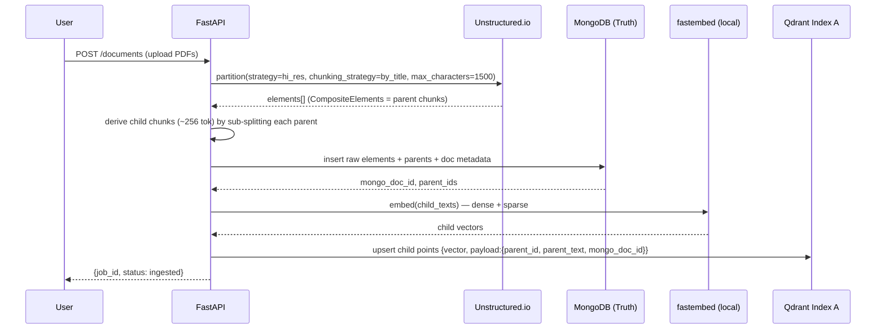
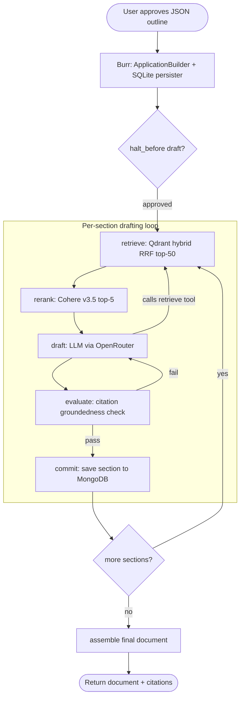

# LexiGraph RAG (MVP)

Agentic RAG that ingests legal precedent PDFs and drafts short, citation-grounded
multi-section documents. Built as a Planner–Drafter–Evaluator loop over a
parent-child hybrid retrieval index.

> **New here? Start with the visual walkthrough → [`docs/concepts.html`](docs/concepts.html)**
> The seven things that make this *not* plain RAG — two-store split, dedupe-before-rerank,
> the verify-and-redraft loop, and memory that flows forward. Open it in a browser.

## Stack
- **API:** FastAPI
- **Ingestion:** Unstructured.io (serverless) → parent chunks → derived child chunks
- **Truth store:** MongoDB Atlas
- **Vector store:** Qdrant Cloud (Index A) — native dense+sparse RRF hybrid search
- **Reranker:** Cohere Rerank v3.5
- **Orchestration:** Apache Burr (state machine, human-in-the-loop pause/resume)
- **LLM:** via **OpenRouter** (OpenAI-compatible) — model is a config value (`MODEL_ID`), swappable
- **Embeddings:** local via fastembed (`bge-small-en-v1.5` dense + BM25 sparse) — no extra key

## Scope (v1)
Parent-child chunking + hybrid search + rerank + a Burr drafting loop producing a
~5–10 section document with paragraph-level citations. Dual-index rolling memory
(Index B) and the CRAG entailment evaluator are deferred to Phase 2.

Full design incl. the low-level design (LLD):
`~/.claude/plans/i-am-trying-to-lively-cat.md` (approved plan).

---

## Data Flow Diagrams

### 1. Ingestion & Indexing



### 2. Agentic Drafting Loop (the "Factory Loop")



---

## High-Level Design (HLD)

### Components
| Component | Tech | Responsibility |
|---|---|---|
| API layer | FastAPI | upload docs, submit/approve outline, run job, fetch result |
| Ingestion | Unstructured client | partition → parent chunks → derive children |
| Truth store | MongoDB Atlas | raw elements, parents, outlines, drafted sections, jobs |
| Vector store | Qdrant Cloud (Index A) | child dense+sparse vectors, hybrid RRF search |
| Retrieval | Qdrant + Cohere | hybrid search → rerank → distinct parent chunks |
| Orchestrator | Apache Burr | state machine: retrieve→draft→evaluate→commit, pause/resume |
| LLM interface | OpenRouter (Mirascope) | typed calls; model in config, swappable |
| Embeddings | fastembed (local) | dense (bge-small) + sparse (BM25) |

### Module layout
```
app/
  api/          FastAPI routes (thin; delegate to services)
  ingestion/    partition + chunk + persist
  retrieval/    embeddings + hybrid search + rerank
  drafting/     LLM interface + Burr actions/graph + outline
  stores/       MongoDB + Qdrant client wrappers
  models/       Pydantic schemas (shared contracts)
  config.py     settings (keys, model id, collection name)
```

### Key design decisions
- **Parent/child is derived, not native.** Unstructured `by_title` yields one level
  (parents); children are sub-split by us (~256 tok) for high-precision matching.
- **Active retrieval = tool-calling**, not fine-tuned Self-RAG reflection tokens.
- **Contradictions preserved.** Rerank returns *distinct* parents, so conflicting
  terms (Net 30 vs Net 60) both survive as separate cited candidates.
- **Groundedness gate.** Every citation must resolve to a real retrieved `parent_id`
  and be supported by that source, else the section is redrafted.

---

## Running the app

```bash
cp .env.example .env      # then fill in keys (see below)
./run.sh                  # creates venv, installs deps, starts server on :8000
./run.sh --no-install     # faster restarts (skip pip install)
```

Then open **http://localhost:8000/docs** for interactive API docs.

**End-to-end flow:**
1. `POST /documents` — upload precedent PDFs (ingested into Index A)
2. `POST /jobs` — `{ "prompt": "Draft an MSA for ..." }` → returns a draft outline
3. `GET /jobs/{id}/outline` — review it
4. `POST /jobs/{id}/outline/approve` — approve (or send an overridden `Outline`)
5. `POST /jobs/{id}/run` — run the Factory Loop
6. `GET /jobs/{id}/document` — fetch the assembled, cited document

---

## Getting the API keys

Copy `.env.example` to `.env` and fill in these five services. All have free tiers
adequate for the MVP. Embeddings run locally (fastembed), so there is **no** sixth
embedding key.

### 1. OpenRouter — `OPENROUTER_API_KEY` (the LLM)
- Go to **https://openrouter.ai** → sign in → **Keys** (https://openrouter.ai/keys) →
  **Create Key**.
- Add credit under **Credits** (pay-as-you-go). The model is set by `MODEL_ID`
  (default `anthropic/claude-opus-4-8`); browse alternatives at
  https://openrouter.ai/models and change that one value to swap models.

### 2. Unstructured — `UNSTRUCTURED_API_KEY` (PDF parsing)
- Go to **https://platform.unstructured.io** → sign up → **API Keys** → create a key.
- The dashboard also shows your **API URL**; put it in `UNSTRUCTURED_API_URL`
  (default `https://api.unstructuredapp.io`).

### 3. MongoDB Atlas — `MONGODB_URI` (truth store)
- Go to **https://www.mongodb.com/cloud/atlas** → create a free **M0** cluster.
- **Database Access** → add a database user (username + password).
- **Network Access** → allow your IP (or `0.0.0.0/0` for dev).
- **Connect → Drivers → Python** → copy the `mongodb+srv://...` string, insert your
  password, and paste into `MONGODB_URI`. Set `MONGODB_DB` (default `lexigraph`).

### 4. Qdrant Cloud — `QDRANT_URL` + `QDRANT_API_KEY` (vector store)
- Go to **https://cloud.qdrant.io** → sign up → create a free **1 GB** cluster.
- Copy the cluster **URL** into `QDRANT_URL`, and generate/copy the **API key** into
  `QDRANT_API_KEY`. The collection (`QDRANT_COLLECTION`, default `index_a`) is created
  automatically on startup.

### 5. Cohere — `COHERE_API_KEY` (reranking)
- Go to **https://dashboard.cohere.com** → sign up → **API Keys**
  (https://dashboard.cohere.com/api-keys) → copy your key.
- The free **trial key** works for rerank. Model is `COHERE_RERANK_MODEL`
  (default `rerank-v3.5`).

> **Security:** `.env` is gitignored — never commit real keys. Use `.env.example`
> (placeholders only) as the shared template.
